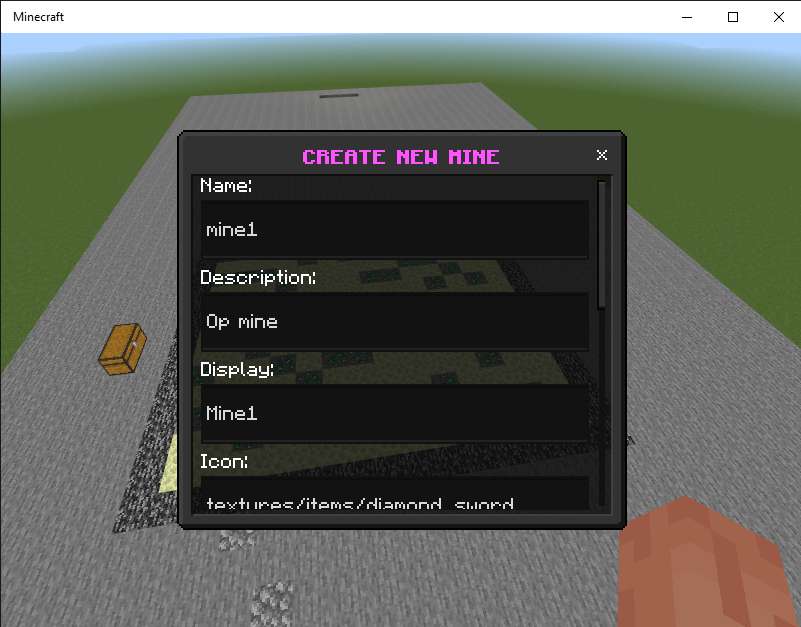
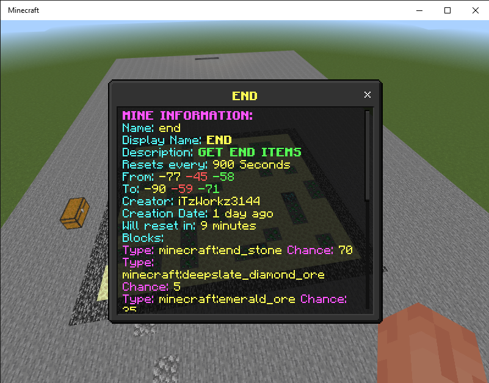

# MINES+
MINES+ is an addon for [MINECRAFT BEDROCK](https://www.microsoft.com/es-ec/p/minecraft-for-windows/9nblggh2jhxj?activetab=pivot:overviewtab) which will allow you to create and mines in your world! 
# HOW TO SETUP
When starting MINES+, if you are a server administrator, you must add the "Admin" tag to be able to create a new mine. Otherwise, you won't be able to create mines. Now that you have this clear, run the command **".mines"** in chat to open the **MINES+** form

# Modules

###### Lets start creating a new mine: <br>
You have to fill the inputs, not all of them, some are optional like description, display, icon and reset message.
<a href="#modules" target="blank"></a>

###### Once you have created your first mine, a new button will show up in the **MINES+** menu. This is the mine you just created, this will show you information about the mine and it has some buttons to execute multiple functions such as:
<a href="#modules" target="blank"></a><br>

-Add block: Add a new block with its custom chance to appear.<br>
-Edit mine: Lets you to edit the information you put when creating this mine.<br>
-Delete mine: This will delete the mine.<br>
-Reset mine: This will reset the mine if it doesn't have a timer.<br>
-Remove Block: Lets you to remove a block from the mine.<br>
-Reset Blocks: This will delete all the blocks in the mine.<br>

# FOR DEVS
If you have some knowledge in javascript or typescript, I will show you how you can execute code when some MINES+ event is fired

# MINES+ EVENTS

## MINE CREATED
```scripts/plugins/mines/main.js```

```ts
emitter.on('mineCreated', (res) => {
    /**
     * THIS EVENT FIRES WHEN A MINE IS CREATED
     * Arguments:
     * data: Data of the mine that has been created
     * player: Player who created the mine
     */
})
```

## MINE DELETED
```ts
emitter.on('mineDeleted', (res) => {
    /**
     * THIS EVENT FIRES WHEN A MINE IS DELETED
     * Arguments:
     * data: Data of the mine that has been deleted
     * player: Player who deleted the mine
     * isReset: Boolean representing if the delete was for a reset; example: add new blocks.
     */
})
```

## MINE EDITED
```ts
emitter.on('mineEdited', (res) => {
    /**
     * THIS EVENT FIRES WHEN A MINE IS EDITED
     * Arguments:
     * data: New data of the mine that has been edited
     * player: Player who edited the mine
     * oldData: Old data of the mine that has been edited
     */
})
```

## MINE BLOCKS CHANGE
```ts
emitter.on('mineBlocksChange', (res) => {
    /**
     * THIS EVENT FIRES WHEN MINE BLOCKS ARE CHANGED
     * Arguments:
     * data: Data of the mine
     * player: Player who added the block
     * block: Block or blocks that are added
     * chance: Chance or chances of the block(s)
     */
    res.player.sendMessage('§l§aMINES+ > §r §eSuccess§r')
})
```

## MINE RESET
```ts
emitter.on('mineReset', (res) => {
    /**
     * THIS EVENT FIRES WHEN A MINE IS RESET
     * Arguments:
     * data: Data of the mine that has been reset
     * player: Player who reset the mine (optional)
     */
    if (res?.player) res.player.sendMessage(`§l§aMINES+ > §r§eYou have reset the mine §r§7${res.data?.display ? res.data?.display : res.data.name}§r`)
    if (res.data?.reset?.message)
        world.sendMessage(res.data.reset.message)
    else world.sendMessage(`§l§aMINES+ > §r§eMine §r§7${res.data?.display ? res.data?.display : res.data.name}§r §ehas been reset!§r`);
    const box = BoundingBoxUtils.createValid(res.data.from, res.data.to)
    const max = BlockVolumeUtils.getMax({ from: res.data.from, to: res.data.to })
    world.getAllPlayers().filter(p => BoundingBoxUtils.isInside(box, p.location)).forEach(p => p.teleport(new Vector(p.location.x, max.y + 1, p.location.z)))
})
```

# Download
<a href="https://www.mediafire.com/file/a9hck1c5w3xa7eq/MINES%252B_v1.0.mcaddon/file" target="blank"></a>

# MY SOCIAL NETWORKS
<a href="https://www.youtube.com/channel/UCcb6TseFTpboFwgZM737IGA" target="blank"></a>
